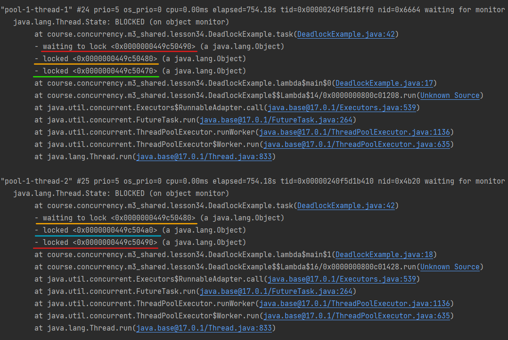

# Задание 3. Практика: задачи на тему дедлоков #

#### Задача 1: ####

Задаче для выполнения нужно захватить 3 объекта Х.
В системе выполняются 2 такие задачи.
Система мониторинга прислала алерт, что обнаружен дедлок.
Сколько объектов Х могут быть в статусе locked?

(подсказка: сначала рассмотрите вариант, когда в системе 2 задачи)

#### Задача 2: ####

В пуле соединений ConnectionPool находятся X объектов.
Задаче А нужно 2 любых объекта X из пула, чтобы выполниться.
После завершения задачи объекты X возвращаются в пул.
В системе выполняются не более 5 (пяти) задач А. 
Какое минимальное количество объектов X должно быть в пуле, чтобы все задачи смогли завершиться?

(подсказка: сначала рассмотрите вариант, когда в системе 2 такие задачи)

#### Ответы: ####

Задача 1: В статусе locked может быть 4 объекта X. Если я правильно понимаю, то объекты Х в
данном случае являются ресурсами, а задачи могут быть потоками. При этом, чтобы deadlock в принципе был 
возможен, нужно чтобы каждый из потоков захватил один ресурс и ожидал захвата второго, т.е. необходимо
как минимум два ресурса. В данном случае, чтобы задача выполнилась необходимо три объекта. Если рассматривать
две задачи, то для возникновения deadlock-а, необходимо чтобы и первой и второй задаче понадобились объекты 
Х1 и Х2. При этом, т.к. задаче нужны три объекта для выполнения, то возможна ситуация когда первой задаче 
понадобится объект Х3, а второй задаче понадобится объект Х4. Таким образом получаем ситуацию, что при 
возникновении deadlock-а в системе может быть заблокировано до 4-х объектов. Предположим, что синхронизация
реализована с помощью мониторов. Тогда первая задача будет, например, держать мониторы объектов X1 и X3 и ждать
захвата монитора X2, а вторая задача будет держать мониторы объектов Х2 и Х4 и ждать захвата монитора Х1.

Написал иллюстративный [код](./DeadlockExample.java), и снял [thread dump](./dead-lock-example-thread-dump2.txt).
Thread dump показывает что заблокированы четыре объекта:

Задача 2: Считаю, что для завершения 5 задач в пуле должно быть минимум 6 соединений. Логика следующая:
допустим в системе выполняются две задачи. Если каждая задача возьмет по одному соединению из пула,
то для завершения хотя бы одной из них, необходимо еще одно соединение. В противном случае каждая из задач
захватит по одному соединению и будет бесконечно ожидать второго. Исходя из этой логики, чтобы все задачи
могли завершиться число соединений в пуле должно быть на единицу больше числа задач.