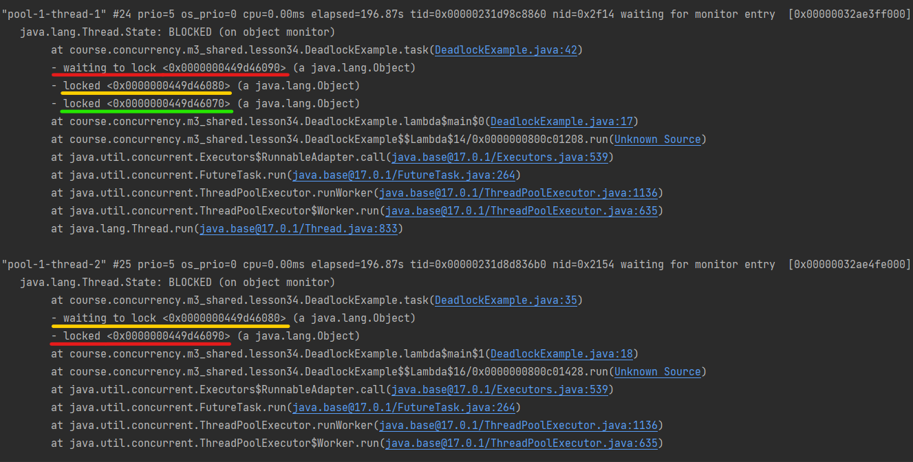

# Задание 3. Практика: задачи на тему дедлоков #

#### Задача 1: ####

Задаче для выполнения нужно захватить 3 объекта Х.
В системе выполняются 2 такие задачи.
Система мониторинга прислала алерт, что обнаружен дедлок.
Сколько объектов Х могут быть в статусе locked?

(подсказка: сначала рассмотрите вариант, когда в системе 2 задачи)

#### Задача 2: ####

В пуле соединений ConnectionPool находятся X объектов.
Задаче А нужно 2 любых объекта X из пула, чтобы выполниться.
После завершения задачи объекты X возвращаются в пул.
В системе выполняются не более 5 (пяти) задач А. 
Какое минимальное количество объектов X должно быть в пуле, чтобы все задачи смогли завершиться?

(подсказка: сначала рассмотрите вариант, когда в системе 2 такие задачи)

#### Ответы: ####

Не совсем уверен, что правильно понял вопрос, но попробую ответить.

Задача 1: В статусе locked может быть 3 объекта X. Если я правильно понимаю, то объекты Х в
данном случае являются ресурсами, а задачи могут быть потоками. Например, возможна такая ситуация:
пусть первая задача (поток) захватит два ресурса, к примеру объекты Х1 и Х2, тогда вторая задача (поток)
сможет захватить только объект Х3, а затем будет вынуждена ожидать сначала освобождения одного из объектов
Х1 или Х2. Допустим что вторая задача будет сначала ожидать освобождения объекта X2. Получается, что в конкретный
момент времени первая задача ждет освобождения объекта X3, вторая задача ждет освобождения объекта X2,
но при этом X1 тоже захвачен первой задачей и второй задаче, чтобы завершиться, нужно будет дождаться
и освобождения X1. Первой же задаче, для завершения нужно будет дождаться освобождения X3. В моем понимании
это значит, что заблокированы три объекта X. Другими словами, если предположить, что синхронизация реализована
с помощью мониторов, то будет захвачено 3 разных монитора, но при этом первая задача будет ожидать захвата
одного монитора (в нашем примере монитора объекта Х3), а вторая задача будет ожидать захвата другого монитора 
(в нашем примере монитора объекта X2).

Написал иллюстративный [код](./DeadlockExample.java), и снял [thread dump](./deadlock-example-thread-dump.txt).
Thread dump показывает что заблокированы три объекта:

Задача 2: Считаю, что для завершения 5 задач в пуле должно быть минимум 6 соединений. Логика следующая:
допустим в системе выполняются две задачи. Если каждая задача возьмет по одному соединению из пула,
то для завершения хотя бы одной из них, необходимо еще одно соединение. В противном случае каждая из задач
захватит по одному соединению и будет бесконечно ожидать второго. Исходя из этой логики, чтобы все задачи
могли завершиться число соединений в пуле должно быть на единицу больше числа задач.