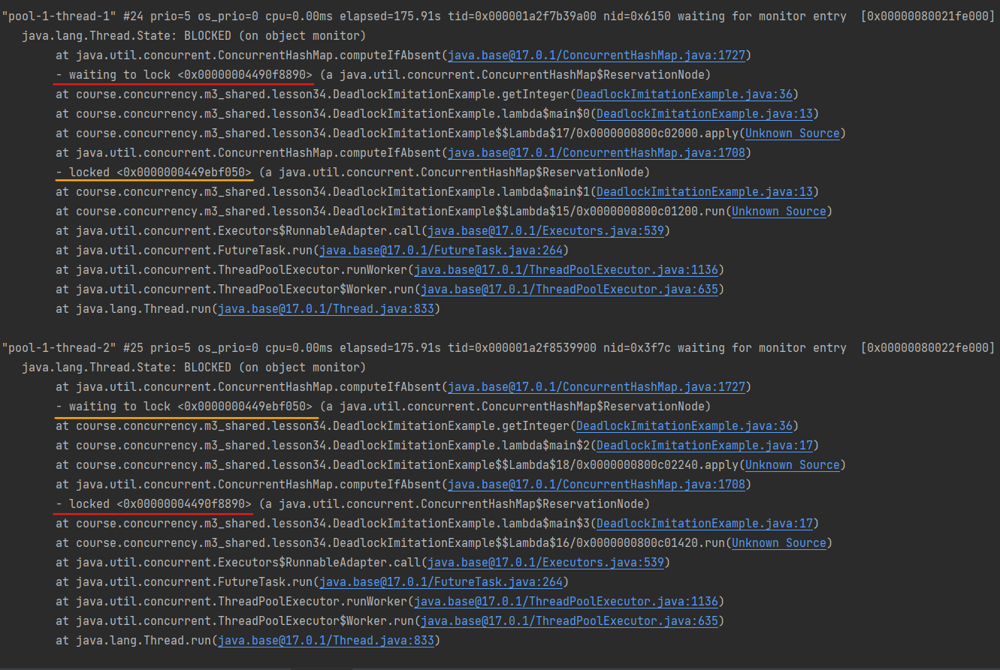

# Задание 4. Практика: имитация дедлоков #

1. Изучите исходный код ConcurrentHashMap и механизмы синхронизации (если они есть) в методах:
    * compute
    * computeIfAbsent
    * merge
    * putVal
    * clear
2. Вспомните признаки дедлока
3. Напишите код, используя методы выше, который может привести к дедлоку

#### Решение ####

Написал код, использующий метод [computeIfAbsent](./DeadlockImitationExample.java).
Запустил, поймал дедлок, получил [Thread dump](./concurrent-hash-map-deadlock.txt)

